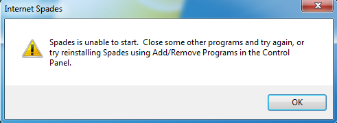
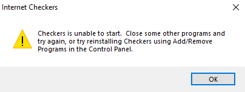
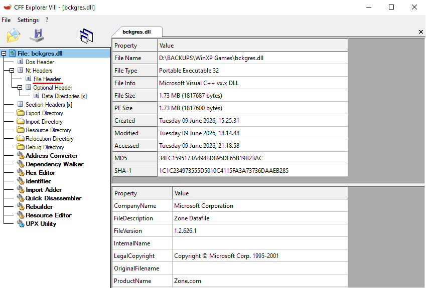
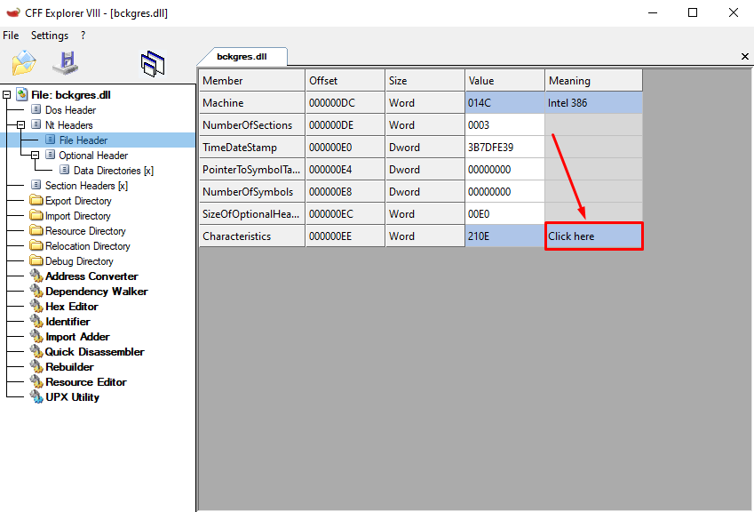
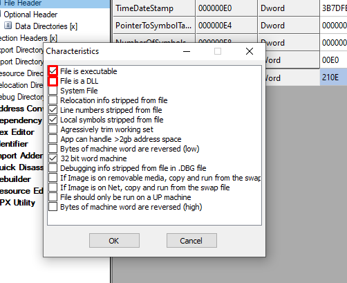
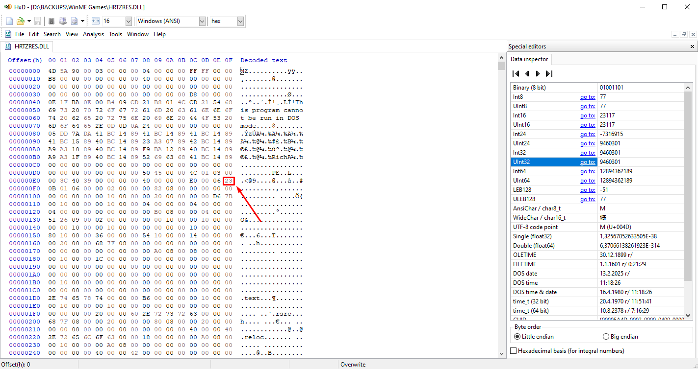
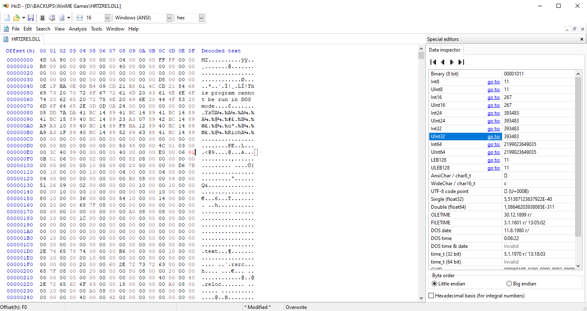
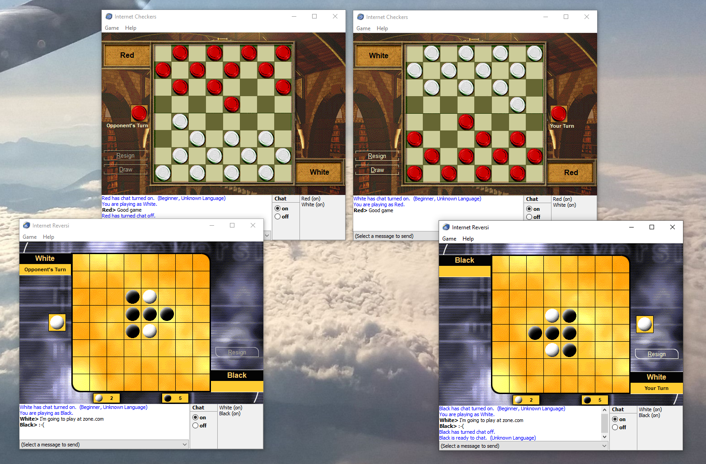

# Running Windows XP/ME Internet Games on later Windows versions

Windows XP/ME Internet Games, with a few tweaks, can be launched on all later versions of Windows.

## Guide

1. Copy the Internet Games over from a Windows XP/ME installation. They are located under "C:\Program Files\MSN Gaming Zone\Windows". **Make sure to copy over all files!**

When trying to run any of the games, you will see an error message that prompts you to reinstall the games.

> 

This is due to the host executable "zClientm.exe" not having been registered as a COM server, making the game executable unable to spawn it.

2. Register "zClientm.exe" as a COM server on your system by opening a Command Prompt **as Administrator** and running:

```
zClientm.exe /RegServer
```

Up to Windows 7, this should be enough to get the games running!

### Windows 10/11 (possibly 8/8.1)

On later Windows versions, it is likely that even after registering the COM server, you would still get the same "unable to start" error message.

> 

This means you have to patch the resource DLLs the games utilize, as they cannot be loaded by "zClientm.exe". Those include:

* "**Cmnresm.dll**": Common shared resources - used by all games, so it **has to be patched** for any of them to run!
* "**bckgres.dll**": Backgammon resources - used by Backgammon only.
* "**chkrres.dll**": Checkers resources - used by Checkers only.
* "**Hrtzres.dll**": Hearts resources - used by Hearts only.
* "**Rvseres.dll**": Reversi resources - used by Reversi only.
* "**Shvlres.dll**": Spades resources - used by Spades only.

The culprit is a flag in the ["Characteristics" field](https://learn.microsoft.com/en-us/windows/win32/debug/pe-format#characteristics)
in the header of these DLLs, which declares them as runtime libraries (`IMAGE_FILE_DLL`).
The issue, however, is that these libraries do not contain any executable code (they only provide resources), so Windows considers this flag malformed/corrupt.
As to prevent exploitation, the stricter DLL loader of newer Windows versions immediately unloads the library and returns `ERROR_INVALID_PARAMETER`.
This causes the "zClientm.exe" host to return an unspecified failure error (`E_FAIL (0x80004005)`) back to the game executable you are trying to launch
and since it cannot do anything further, it shows that same error message.

Here are two ways you can fix this:

#### Using [CFF Explorer](https://ntcore.com/files/CFF_Explorer.zip)

CFF Explorer is a Portable Executable (PE) editor, meaning binary files like ".exe", ".dll", and ".sys".

Using this tool, we can strip the problematic flag from our DLLs.

1. Open a DLL in CFF Explorer and in the sidebar, head to "File Header" (under "Nt Headers").

> 

2. At the last column on the "Characteristics" row, press "Click here".

> 

3. In the dialog that appears, uncheck "File is a DLL". Ensure "File is executable" remains checked.

> 

4. Press "OK" in the dialog and head to File -> Save. Overwrite the original file by choosing "Yes".

Repeat this for all 6 resource DLLs listed above.

#### Using a Hex editor

Since we are talking about a flag in the header of a DLL, we can of course modify the field manually using a Hex editor.
I will use [HxD](https://mh-nexus.de/en/hxd/) in this example.

1. Open a DLL in your Hex editor. Head to the byte at 0xEF.

> 

2. Edit this byte to "01" to strip the problematic flag.

> 

3. Save the edited DLL over the original.

Repeat this for all 6 resource DLLs listed above.



## Unregistering

If you wish to unregister "zClientm.exe" as a COM server, execute the following in a Command Prompt, opened **as Administrator**:

```
zClientm.exe /UnregServer
```
